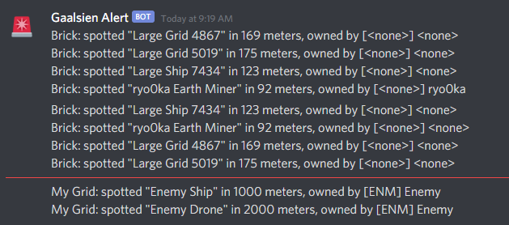
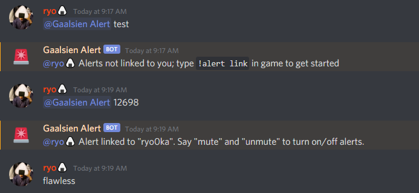

# Torch Alert

Space Engineers + Discord version of Rust Raid Alert. 
Players will be notified on Discord whenever UFO approaches their base.

## Setup (Discord bot)

1. Make an application & a bot on [Discord Developer Portal](https://discord.com/developers/applications)
1. Get the bot token (used later)
1. Enable the bot's presence intent & server members intent
1. Invite the bot to your Discord server
1. Give it a role & show it on the right pane

## Bot Icon

woo woo

## Setup (Plugin)

1. Grab the binary in [Torch plugin repository](https://torchapi.net/plugins/item/5a486edf-d677-4c5d-a4d7-9015dd9fb20b)
1. Install the plugin like usual
1. Assign the bot token (from earlier) to the plugin config; **no restart required**
1. Do some config tweaking if you want to

## Setup (User)

1. Mention or DM the bot (not required)
1. In game, type in `!alert link` (or as a command line, `!alert link <your steam id>`)
1. Note down the link ID that the plugin spits out in response to the command
1. Mention or DM the bot with the link ID
1. Get some grids in and and out of the alert zone

## Config

* Discord bot token
* Enable/disable the whole process
* "Scan" interval
* "Scan" radius
* Alert message format (Markdown supported I guess)
* Log file path
* Show/hide console logs
* Enable/disable trace logs

Note no config requires a restart

## Bug Fix & Feature Requests

Ping @ryo in #plugins on Torch Discord
